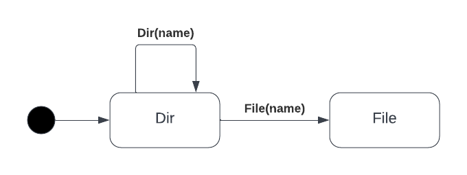

# command-line
A framework for processing argument combinations for command line interfaces.

### CommandLine
A structure containerizing data passed from the command line and environment.

### Auto-Generated Error Correction
If an argument is passed to the command line that is not recognized, the command line will compare the letters in the provided word to the registered commands and output a list of possible commands that the user attempted to type.

### Auto-Generated Help
When the argument *help* is passed to the command line, the commandline will automatically output every command and description registered to the struct.

### MetaData
Data collected from the environment when the executable is invoked.

```go
type CommandLine struct {
	...
	MetaData struct {
		WorkingDirectory string
		TimeCalled       time.Time
	}
	...
}
```

### Arguments
Arguments are space-delimited information passed to the file when invoked in the terminal. Rather than accessing arguments by index, you can iterate over them using the commandline.NextArg() function. When we hit the end of the arguments, we are returned a value matching commandline.FinalArg.

```go
cli := CommandLine()

value := cli.nextArg()
if value == FinalArg {
    // finished
} else {
    // do something
}
```

### Commands
Commands are structures that implement the *Command* interface. The name returned by the Command will be used to pattern-match on arguments passed to the terminal. 

```go 
type Command interface {
	Name() string
	Run(cli *CommandLine) TerminateOnCompletion
}
```

### Flags
Flags can be used to offer various logical combinations for a single command.

1. create
2. destroy
3. show
4. install

### Path
Rather than using strings and slashes to represent hard-coded resource paths, using builder patterns allow resource paths to take-on a more source-dependant syntax and lead to more readable code.

#### Path Types
Paths are given a type based on what last call was made by the builder pattern.

**File** a path to a file that can call a set of functions belonging to files
**Dir** a path to a directory that can call a set of functions belonging to dirs

#### Path Builder Functions



#### Path Functions
| Type          | Functions                   |
|---------------|-----------------------------|
| Type Agnostic | Exists, DoesNotExist        |
| Dir           | MkDir                       |
 | File          | Create, Read, Write, Remove |

Functions such as Create, MkDir, Read, and Exists are also extended to verify whether the current path is a File or  

```go
file := commandline.EmptyPath().Dir("resources").File("data.json")

if file.DoesNotExist() {
	file.Create()
}
```